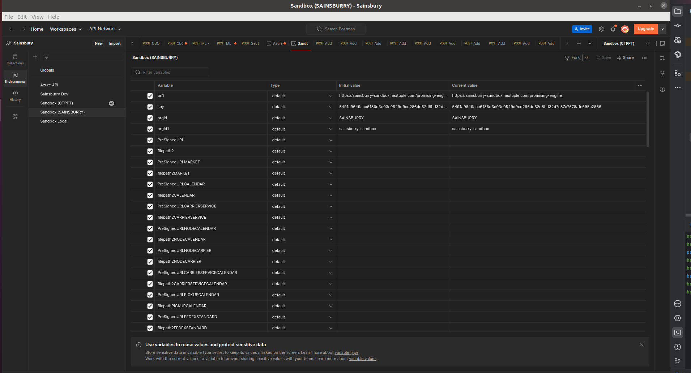
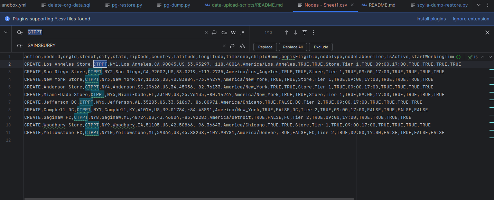
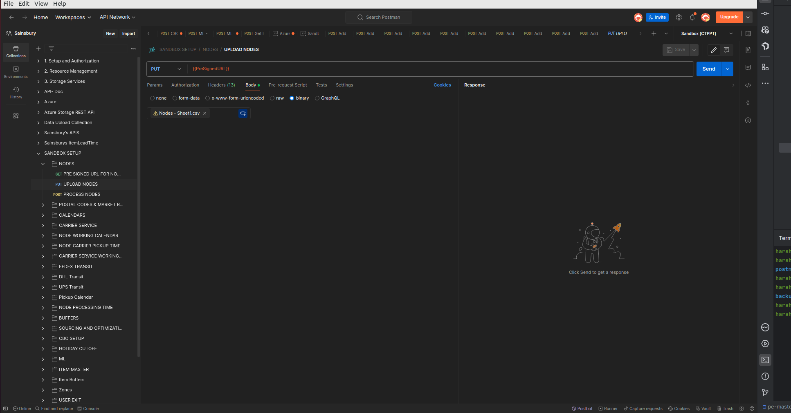

# Running data upload scripts for spinning up tenant in sandbox environment with Factory data setup

There are two ways of setting up factory data in sandbox env or general in any env. Both the ways brings the same result, only difference is with respect to process of setting up.

## About Data 
As of now the data can support following features of promising and sourcing engine:
1. Heuristic optimization
2. Cost based optimization
3. Holiday Cutoff override
4. Node and transit Buffers
5. ML Processing time

- Data compatible with **1.3.0-RELEASE** version of PE 
- Default Tenant Name: **CTPPT**
## Postman
Running postman collection for Data setup

1. checkout to ``/data-upload-scripts/postman``
2. Import collection ``SANDBOX SETUP.postman_collection.json`` in postman
3. Import environment ``Sandbox (CTPPT).postman_environment.json`` in postman
4. Update the **Sandbox (CTPPT)** environment variables with details of new tenant.
   - Here we can duplicate the environment as well and update the details so as to keep existing environment undisturbed. (Preferred approach)
   - And then select that environment.
   

- 
5. Go to ``Sandbox-Setup-Files-CTPPT`` directory, open each CSV file and update orgId with orgId of new tenantID.

   - 
6. Go to collection, and in each module of collection, replace the file in the body with corresponding file for that tenant.

   - 
7. Run each module by updating body with modified file.
8. It will take sometime to run all modules including nested modules.
9. Once all modules are run, verify by hitting the features endpoint in Order Requests module.

## Python

1. Checkout to ``data-upload-scripts/python``
2. Install python and necessary python packages, and run this command
   - ``pip3 install -r requirements.txt`` 
3. Make directory backups, 
   - ``mkdir backups``
4. **Taking PG Dump**
   - Edit ``pg-dump.py`` to change host, port, username and password with details of sandbox DB 
      - Run ``python3 pg-dump.py`` , to dump data
        1. Enter TenantID whose dump has to be taken, here in this case that tenant is CTPPT
        2. It will restore the data with new tenant ID from PG database in backups directory as CSVs.
        3. This will take approx 2-4 mins.
5. **Restoring PG Dump**
   - Edit ``pg-restore.py`` to change host, port, username and password with details of sandbox DB 
     -  Run the ``python3 pg-restore.py``  to restore the data, it will ask for three inputs
        1. Prospect DB Index: It can start from 1000, with a difference of 1000 for every next prospect. Should be unique for each prospect. 
        2. Prospect Name: new tenant name in CAPS. 
        3. And TenantID whose dump has to be taken, here in this case that tenant is CTPPT.
        4. It will restore the data with new tenant ID in PG database.
     - This will take approx 10-20 mins depending on size of dump. 
6. **Dump and Restore Scylla DB**
   - Edit ``scylla-dump-restore.py`` script to dump and restore inventory data. 
     - Run the scylla-dump-restore.py , ``python3 scylla-dump-restore.py``
       1. It will ask for input, TenantID whose dump has to be taken, here in this case that tenant is CTPPT
     - It will take approx 5-10 mins.
7. This will create all the required factory data, verify by hitting the features endpoint in Postman's Order Requests module.

## Verify data setup

- Test with this URL, ``https://<new-tenant-dns>-sandbox.nextuple.com/auth/login``, The data should appear upon login with the cretaed credentials
- Import postman collection, and hit API request present in ``order request module``, the request should return valid EDD responses.
     
      